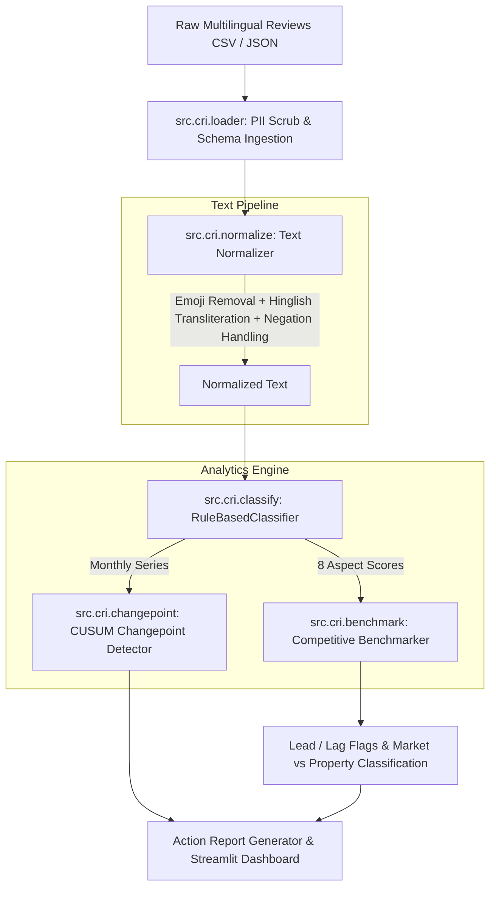

# Multilingual Tourism Review Intelligence Engine

## The Problem
Tourism boards and hotel cluster managers in India rely on aggregate star ratings (e.g., "4.1★") that mask critical operational failures—a property can maintain high overall ratings while its food quality or room cleanliness collapses. Furthermore, existing review analytics tools ignore Hinglish (Hindi-English code-mixed) and Devanagari reviews, which constitute the majority of feedback from domestic Indian tourists. This engine resolves these blind spots by providing aspect-level, competitive, and time-aware intelligence.

## What This Does
- **Aspect-Level Sentiment Analysis**: Parses English, Hinglish, and Devanagari reviews across 8 core hotel aspects (Food, Room, Staff, Housekeeping, Location, Value for Money, Cleanliness, Booking Experience) with explainable phrase matching.
- **Cluster Competitive Benchmarking**: Computes cluster-wide aspect averages to tag each property with Lead/Lag/Neutral performance flags and distinguishes property-specific operational issues from market-wide trends.
- **CUSUM Changepoint Detection**: Tracks longitudinal sentiment dynamics to pinpoint exact dates when aspect quality shifted upward or downward.

## Architecture



## How to Run
```bash
make setup
make generate
make pipeline
make dashboard
```

## Key Findings (from synthetic validation)
- **Pattern 1 (P1 Food Decline)**: Property P1's Food sentiment drops significantly from early months (months 2-3) to late months (months 5-6) due to an injected quality failure, statistically verified via independent two-sample t-test ($p < 0.05$).
- **Pattern 2 (Cluster C2 Winter Room Dip)**: Cluster C2 demonstrates a statistically significant seasonal drop in Room sentiment during winter months (Nov–Feb) compared to summer ($p < 0.05$), proving market-wide issue classification.
- **Pattern 3 (P4 Staff Improvement)**: Property P4's Staff sentiment increases significantly starting in Month 4 ($p < 0.05$), correctly triggering a CUSUM upward changepoint detection.

## What I Learned
- **Reflections**: I initially attempted relying solely on generic sentiment polarity lexicons, but extracting 8 distinct aspect scores required creating a tailored multilingual keyword/phrase taxonomy to resolve code-mixed Hinglish ("khana accha tha", "paisa vasool") and Devanagari expressions accurately.
- **Limitations**: The current MVP relies on a rule-based classifier taxonomy rather than a deep contextual neural model, which can struggle with complex sarcasm or double-negatives.
- **Future Improvements**: Given more time, I would implement a pluggable fine-tuned mBERT / XLM-RoBERTa transformer backend using the defined `Classifier` abstract base class interface.

## Tech Stack
| Category | Technology |
| :--- | :--- |
| **Language** | Python 3.12 |
| **Data Processing** | Pandas 2.2, NumPy 1.26, SciPy 1.14 |
| **Visualization** | Streamlit 1.38, Plotly 5.24, Matplotlib 3.9 |
| **Testing** | Pytest 8.3, Pytest-Cov 5.0 |

## Data
Synthetic data generated by `src/cri/generate.py` (5,000 reviews across 12 properties and 3 clusters). Ground-truth structural patterns were injected for pipeline validation and statistical testing. No real user data was used.

## Author
**Aditya Kalure**
- **GitHub**: [aditya242007](https://github.com/aditya242007)
- **Email**: aditya242007@gmail.com
